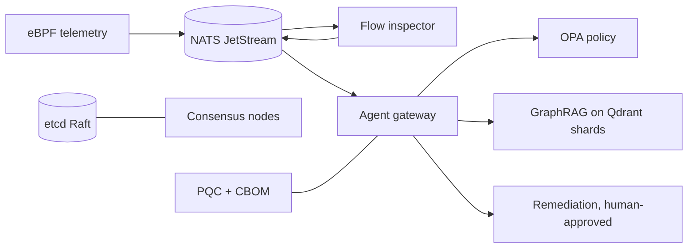

# Architecture

```mermaid
flowchart LR
  EBPF[eBPF telemetry] --> NATS[(NATS JetStream)]
  NATS --> CNN[Flow inspector] --> NATS
  NATS --> AG[Agent gateway] --> OPA[OPA policy]
  AG --> RAG[GraphRAG on Qdrant shards]
  AG --> REM[Remediation, human-approved]
  ETCD[(etcd Raft)] --- CON[Consensus nodes]
  PQC[PQC + CBOM] --- AG
```
Trust boundaries: every agent call is policy-checked, token-scoped to one tool, and logged. High-risk actions need human approval.
